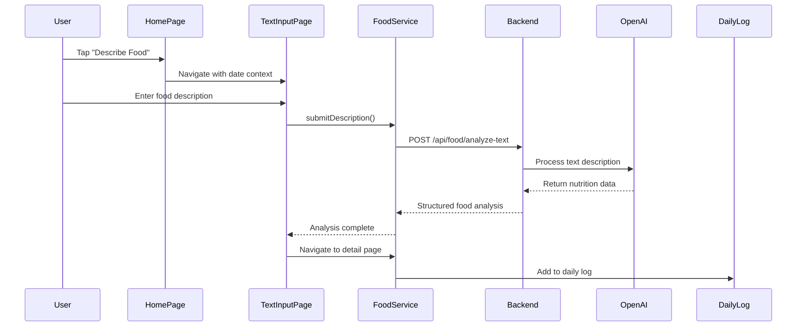

# Add Food Description Feature Design

## Overview

This design document outlines the implementation of text-based food description functionality to complement the existing image-based food analysis. Users will be able to describe their meals in text format and receive AI-powered nutritional analysis without requiring an image.

## Architecture

### Component Flow

```mermaid
graph TD
    A[Home Page] -->|Tap "Describe Food"| B[Text Input Page]
    B -->|Submit Description| C[Food Analysis Service]
    C -->|API Call| D[Backend Service]
    D -->|OpenAI Analysis| E[Nutritional Data]
    E -->|Response| F[Food Detail Page]
    F -->|Save| G[Daily Log]
    
    subgraph Backend
        D --> H[Food Controller]
        H --> I[Food Analysis Service]
        I --> J[OpenAI API]
    end
    
    subgraph State Management
        K[Daily Log Provider]
        L[Pending State]
    end
    
    G --> K
    C --> L
```

### Data Flow



## Frontend Implementation

### New Page: Food Description Input

```dart
class FoodDescriptionPage extends HookConsumerWidget {
  final String dateIso;
  
  Widget build(BuildContext context, WidgetRef ref) {
    final textController = useTextEditingController();
    final isAnalyzing = useState(false);
    
    return Scaffold(
      appBar: AppBar(title: Text('describe_food.title'.tr())),
      body: Column(
        children: [
          TextField(
            controller: textController,
            decoration: InputDecoration(
              hintText: 'describe_food.hint'.tr(),
              helperText: 'describe_food.helper'.tr(),
            ),
            maxLines: 5,
          ),
          ElevatedButton(
            onPressed: isAnalyzing.value ? null : () => _analyzeDescription(),
            child: isAnalyzing.value 
              ? CircularProgressIndicator()
              : Text('describe_food.analyze'.tr()),
          ),
        ],
      ),
    );
  }
}
```

### Modified Home Page Integration

Update the existing "Describe Food" button action in `home_page.dart`:

```dart
_buildActionCard(
  context: parentContext,
  icon: Icons.edit_note,
  title: 'home.describe_food'.tr(),
  subtitle: 'home.describe_food_desc'.tr(),
  color: const Color(0xFFFF9800),
  onTap: () {
    Navigator.of(sheetContext).pop();
    // Navigate to food description page
    final selectedJalali = ref.read(selectedJalaliDateProvider);
    final dateIso = _toIsoFromJalali(selectedJalali);
    context.pushNamed('food-description', extra: dateIso);
  },
),
```

### Data Source Layer

```dart
class FoodRemoteDataSource {
  Future<FoodAnalysisEntity> analyzeDescription({
    required String description,
    String? targetDateIso,
    CancelToken? cancelToken,
  }) async {
    final api = ref.read(apiServiceProvider);
    final Map<String, dynamic> response = await api.post<Map<String, dynamic>>(
      ApiConfig.foodAnalyzeText,
      data: {
        'description': description,
        if (targetDateIso != null) 'date': targetDateIso,
      },
      options: Options(headers: {
        'Content-Type': 'application/json',
        'Accept': 'application/json',
      }),
      cancelToken: cancelToken,
    );
    return FoodAnalysisEntity.fromJson(response);
  }
}
```

### Use Case Layer

```dart
class AnalyzeFoodDescriptionUseCase {
  final FoodRepository repository;
  
  Future<FoodAnalysisEntity> call({
    required String description,
    required String targetDateIso,
    CancelToken? cancellationToken,
  }) async {
    return await repository.analyzeDescription(
      description: description,
      targetDateIso: targetDateIso,
      cancellationToken: cancellationToken,
    );
  }
}
```

## Backend Implementation

### New API Endpoint

Add to `foodController.ts`:

```typescript
public analyzeDescription = asyncHandler(async (req: AuthRequest, res: Response): Promise<void> => {
    const { description, date } = req.body;
    
    if (!description || typeof description !== 'string' || description.trim().length === 0) {
        res.status(400).json({ 
            success: false, 
            error: 'Food description is required',
            timestamp: new Date() 
        });
        return;
    }

    // Setup abort handling
    const ac = new AbortController();
    let aborted = false;
    const onAbort = () => {
        if (!ac.signal.aborted) ac.abort();
        aborted = true;
    };
    req.on('aborted', onAbort);
    req.on('close', onAbort);

    try {
        const analysis = await this.service.analyzeText(description.trim(), { signal: ac.signal });
        
        if (aborted) return;

        const result = {
            title: analysis.title,
            calories: Math.round(analysis.calories || 0),
            portions: Math.max(0.25, analysis.portions || 1),
            proteinGrams: Math.round(analysis.proteinGrams || 0),
            fatGrams: Math.round(analysis.fatGrams || 0),
            carbsGrams: Math.round(analysis.carbsGrams || 0),
            healthScore: Math.max(0, Math.min(10, Math.round(analysis.healthScore || 0))),
            ingredients: analysis.ingredients || [],
        };

        // Save to daily logs if user is authenticated
        const userId = req.user?.userId;
        if (userId) {
            const targetDate = date && typeof date === 'string' ? date.slice(0, 10) : 
                new Date().toISOString().slice(0, 10);
            const timeIso = new Date().toISOString();

            await DailyLog.findOneAndUpdate(
                { userId, date: targetDate },
                {
                    $push: {
                        items: {
                            title: result.title,
                            calories: result.calories,
                            portions: result.portions,
                            proteinGrams: result.proteinGrams,
                            fatGrams: result.fatGrams,
                            carbsGrams: result.carbsGrams,
                            healthScore: result.healthScore,
                            timeIso,
                            imageUrl: null,
                            ingredients: result.ingredients,
                            liked: false,
                        },
                    },
                },
                { upsert: true }
            );

            // Update streak if eligible
            try {
                await updateStreakIfEligible(String(userId), targetDate);
            } catch (e) {
                console.error('Streak update (text) error:', e);
            }

            // Track AI cost
            const cost = analysis.meta?.costUsd;
            if (typeof cost === 'number' && isFinite(cost) && cost > 0) {
                await User.findByIdAndUpdate(userId, { $inc: { aiCostUsdTotal: cost } }).exec();
            }
        }

        res.status(200).json({ 
            success: true, 
            data: result, 
            meta: analysis.meta, 
            timestamp: new Date() 
        });
    } catch (error: any) {
        if (aborted) return;
        
        console.error('Text analysis error:', error);
        res.status(500).json({ 
            success: false, 
            error: error.message || 'Failed to analyze food description',
            timestamp: new Date() 
        });
    }
});
```

### Extended Food Analysis Service

Add to `foodAnalysisService.ts`:

```typescript
public async analyzeText(description: string, options?: { signal?: AbortSignal }): Promise<FoodAnalysisResponse> {
    const prompt = `Analyze the food description provided by the user.

Food description: "${description}"

Return ONLY JSON (no extra text) with keys: title, calories, portions, proteinGrams, fatGrams, carbsGrams, healthScore, ingredients (array of {name, calories, proteinGrams, fatGrams, carbsGrams}).

Rules: 
- Strings MUST be Persian (fa-IR)
- Numbers must be numeric
- healthScore 0..10 integer
- Up to 6 ingredients
- Macros should be roughly consistent (4 kcal/g protein, 4 kcal/g carbs, 9 kcal/g fat) ±20%
- Estimate reasonable portions based on description
- If description is vague, make reasonable assumptions for typical serving sizes`;

    const chat = await this.client.chat.completions.create({
        model: 'gpt-5-mini-mini-mini',
        response_format: { type: 'json_object' } as any,
        messages: [
            {
                role: 'user',
                content: prompt,
            },
        ],
        temperature: 0.3,
        signal: options?.signal,
    });

    const content = chat.choices?.[0]?.message?.content ?? '';
    let parsed: FoodAnalysisResult;
    try {
        parsed = JSON.parse(content);
    } catch (err) {
        throw new Error('AI response parsing failed');
    }

    // Apply same processing as image analysis
    parsed.portions = Math.max(0.25, parsed.portions || 1);
    parsed.ingredients = Array.isArray(parsed.ingredients) ? parsed.ingredients : [];

    // Compute health score
    const computed = this.computeHealthScore(parsed);
    const aiScore = Number(parsed.healthScore);
    if (!Number.isFinite(aiScore) || aiScore <= 0) {
        parsed.healthScore = computed;
    } else {
        parsed.healthScore = Math.round(Math.max(0, Math.min(10, (aiScore + computed) / 2)));
    }

    return {
        data: parsed,
        meta: {
            costUsd: chat.usage ? this.calculateCost(chat.usage) : 0,
        },
    };
}
```

### Route Configuration

Add to `foodRoutes.ts`:

```typescript
// POST /api/food/analyze-text - analyze food from text description
router.post('/analyze-text', authenticateToken, controller.analyzeDescription);
```

## Configuration Updates

### API Configuration

Add to `api_config.dart`:

```dart
class ApiConfig {
  static const String foodAnalyzeText = '/api/food/analyze-text';
  // ... existing configurations
}
```

### Router Configuration

Add to `app_router.dart`:

```dart
GoRoute(
  path: '/food-description',
  name: 'food-description',
  builder: (context, state) {
    final dateIso = state.extra as String? ?? 
        DateTime.now().toIso8601String().substring(0, 10);
    return FoodDescriptionPage(dateIso: dateIso);
  },
),
```

## Localization Updates

### English Translations (`en-US.json`)

```json
{
  "describe_food": {
    "title": "Describe Your Food",
    "hint": "Describe what you ate (e.g., 'grilled chicken breast with rice and vegetables')",
    "helper": "Be specific about portions, cooking method, and ingredients for better accuracy",
    "analyze": "Analyze",
    "analyzing": "Analyzing your description...",
    "placeholder_examples": "Examples:\n• 1 cup of white rice with grilled chicken\n• Large apple with peanut butter\n• Homemade pasta with tomato sauce",
    "tips_title": "Tips for better results:",
    "tip1": "Include portion sizes (1 cup, 2 slices, etc.)",
    "tip2": "Mention cooking methods (grilled, fried, steamed)",
    "tip3": "List main ingredients and sauces",
    "character_limit": "Describe your meal in detail"
  }
}
```

### Persian Translations (`fa-IR.json`)

```json
{
  "describe_food": {
    "title": "توضیح غذای خود",
    "hint": "غذایی که خوردید را توضیح دهید (مثلاً 'سینه مرغ کبابی با برنج و سبزیجات')",
    "helper": "برای دقت بیشتر، اندازه پورشن، روش پخت و مواد اولیه را مشخص کنید",
    "analyze": "تجزیه و تحلیل",
    "analyzing": "در حال تجزیه و تحلیل توضیحات شما...",
    "placeholder_examples": "مثال‌ها:\n• یک لیوان برنج سفید با مرغ کبابی\n• سیب بزرگ با کره بادام زمینی\n• پاستا خانگی با سس گوجه",
    "tips_title": "نکات برای نتایج بهتر:",
    "tip1": "اندازه پورشن را ذکر کنید (۱ لیوان، ۲ تکه و غیره)",
    "tip2": "روش پخت را بگویید (کبابی، سرخ شده، بخارپز)",
    "tip3": "مواد اولیه اصلی و سس‌ها را فهرست کنید",
    "character_limit": "غذای خود را با جزئیات توضیح دهید"
  }
}
```

## State Management Integration

### Provider Updates

The existing `DailyLogProvider` and `AnalyzeFoodImageUseCase` should be extended to support text-based analysis. The pending state management will work identically to image analysis.

### Error Handling

```dart
class FoodDescriptionPage extends HookConsumerWidget {
  Future<void> _analyzeDescription() async {
    final description = textController.text.trim();
    if (description.isEmpty) {
      ScaffoldMessenger.of(context).showSnackBar(
        SnackBar(content: Text('describe_food.error_empty'.tr())),
      );
      return;
    }

    final token = ref.read(dailyLogControllerProvider.notifier).createPendingToken();
    isAnalyzing.value = true;

    try {
      final result = await ref.read(analyzeFoodDescriptionUseCaseProvider)(
        description: description,
        targetDateIso: widget.dateIso,
        cancellationToken: token,
      );

      ref.read(dailyLogControllerProvider.notifier).removeToken(token);
      ref.read(dailyLogControllerProvider.notifier).removeOnePendingPlaceholder();
      
      // Navigate to food detail page with results
      context.pushReplacementNamed('food-detail', extra: FoodDetailArgs(
        dateIso: widget.dateIso,
        title: result.title,
        calories: result.calories,
        proteinGrams: result.proteinGrams,
        fatGrams: result.fatGrams,
        carbsGrams: result.carbsGrams,
        portions: result.portions.toDouble(),
        ingredients: result.ingredients.map((ing) => IngredientItem(
          name: ing.name,
          calories: ing.calories,
          proteinGrams: ing.proteinGrams,
          fatGrams: ing.fatGrams,
          carbsGrams: ing.carbsGrams,
        )).toList(),
      ));
    } catch (e) {
      ref.read(dailyLogControllerProvider.notifier).removeToken(token);
      ref.read(dailyLogControllerProvider.notifier).removeOnePendingPlaceholder();
      
      if (mounted) {
        ScaffoldMessenger.of(context).showSnackBar(
          SnackBar(content: Text('Error: $e')),
        );
      }
    } finally {
      isAnalyzing.value = false;
    }
  }
}
```

## Testing Strategy

### Unit Tests

- Test `analyzeDescription` use case with various input formats
- Test backend text analysis service with different description types
- Validate proper error handling for empty/invalid descriptions

### Integration Tests

- Test complete flow from home page to food detail page
- Verify proper state management and pending placeholder behavior
- Test localization for both English and Persian

### Performance Considerations

- Implement input debouncing for real-time suggestions
- Add character limits to prevent excessive API costs
- Cache common food descriptions for faster response times

## Accessibility

- Ensure text input field has proper semantic labels
- Support voice input for food descriptions  
- Implement proper focus management and keyboard navigation
- Add haptic feedback for successful analysis completion

This design provides a comprehensive text-based food description feature that integrates seamlessly with the existing image analysis workflow while maintaining consistency with the app's architecture and user experience patterns.