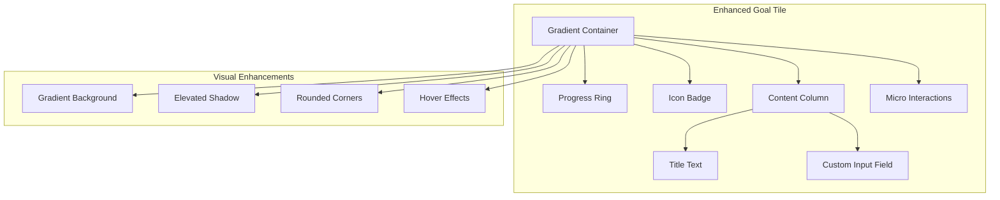
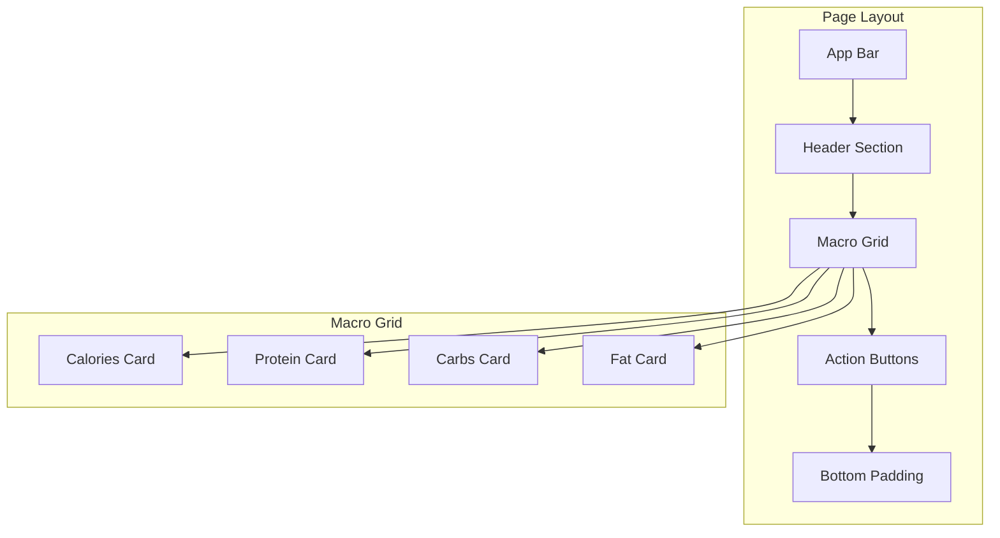

# Adjust Macros Page UI Improvement Design

## Overview

This design document outlines comprehensive UI improvements for the `adjust_macros_page.dart` in the cal_ai Flutter application. The improvements focus on implementing modern design principles including enhanced visual hierarchy, improved spacing, gradient elements, and better user experience patterns while maintaining the existing functionality and internationalization support.

## Current State Analysis

### Existing Implementation
The current `AdjustMacrosPage` includes:
- Basic macro input fields (calories, protein, carbs, fat)
- Progress ring visual elements for each macro
- Auto-generate functionality via additional info page
- Save functionality with loading states
- Full internationalization support

### Identified Areas for Improvement
1. **Visual Hierarchy**: Limited differentiation between elements
2. **Color Scheme**: Basic colors without modern gradient treatments
3. **Spacing & Layout**: Could benefit from more sophisticated grid layouts
4. **Interactive Elements**: Basic button styles and feedback
5. **Card Design**: Simple containers without modern styling
6. **Loading States**: Basic circular progress indicator

## Technology Stack & Dependencies

### Current Dependencies
- **flutter**: UI framework
- **hooks_riverpod**: State management
- **flutter_hooks**: React-style hooks for Flutter
- **easy_localization**: Internationalization
- **go_router**: Navigation

### Design System Integration
- Maintain compatibility with existing theme configuration
- Follow project's internationalization patterns
- Preserve Riverpod state management architecture

## Component Architecture

### Enhanced Goal Tile Component



### Improved Layout Structure



## UI Enhancement Specifications

### Color Palette & Gradients

#### Macro-Specific Color Schemes
- **Calories**: Linear gradient from `Color(0xFF1A1A1A)` to `Color(0xFF404040)`
- **Protein**: Linear gradient from `Color(0xFFFF6B35)` to `Color(0xFFFF8C42)`
- **Carbs**: Linear gradient from `Color(0xFFFFD23F)` to `Color(0xFFFFA726)`
- **Fat**: Linear gradient from `Color(0xFF2196F3)` to `Color(0xFF42A5F5)`

#### Background & Surface Colors
- **Card Background**: `Color(0xFFFAFBFC)` with subtle gradient overlay
- **Input Field**: `Color(0xFFF8F9FA)` with focus state `Color(0xFFE3F2FD)`
- **Shadow**: `Colors.black.withOpacity(0.08)` for depth

### Typography Enhancement

#### Text Styles
- **Page Title**: `headlineSmall` with `FontWeight.w700` and letter spacing `0.5`
- **Macro Labels**: `bodyMedium` with `FontWeight.w600`
- **Input Values**: `titleMedium` with `FontWeight.w500`
- **Button Text**: `titleMedium` with `FontWeight.w600`

### Spacing & Layout Grid

#### Grid System
- **Container Padding**: `EdgeInsets.symmetric(horizontal: 20, vertical: 16)`
- **Card Spacing**: `16dp` vertical gap between cards
- **Internal Padding**: `16dp` for card content
- **Icon Size**: `24dp` for consistency
- **Progress Ring**: `64dp` diameter

### Enhanced Card Design

#### Card Specifications
- **Border Radius**: `20dp` for modern rounded appearance
- **Elevation**: Custom shadow with `blurRadius: 12`, `offset: Offset(0, 6)`
- **Background**: Gradient overlay on white base
- **Border**: Subtle `1dp` border with `Color(0xFFE8EAED)`

### Interactive Elements

#### Button Enhancements
- **Primary Button**: Gradient background with scale animation on press
- **Secondary Button**: Outlined style with gradient border
- **Loading State**: Custom animated loading indicator with brand colors
- **Haptic Feedback**: Light haptic feedback on button press

#### Input Field Improvements
- **Focus Animation**: Smooth border color transition
- **Error States**: Red gradient border for validation errors
- **Success States**: Green accent for successful input
- **Placeholder Animation**: Floating label animation

## Micro-Interactions & Animations

### Animation Specifications

#### Card Hover Effects
```dart
AnimationController(duration: Duration(milliseconds: 200))
```
- Scale: `1.0` to `1.02` on hover/press
- Shadow: Increase blur radius from `12` to `16`

#### Progress Ring Animation
```dart
AnimationController(duration: Duration(milliseconds: 1500))
```
- Curve: `Curves.easeInOutCubic`
- Progress fill animation when values change

#### Button Press Animation
```dart
AnimationController(duration: Duration(milliseconds: 100))
```
- Scale: `1.0` to `0.98` on press down
- Return to `1.0` on release

### Transition Effects
- **Page Entry**: Slide up animation with fade in
- **Card Stagger**: Sequential card appearance with `100ms` delay
- **Save Success**: Checkmark animation with green gradient flash

## Responsive Design Considerations

### Breakpoint Strategy
- **Mobile Portrait**: Single column layout (current)


