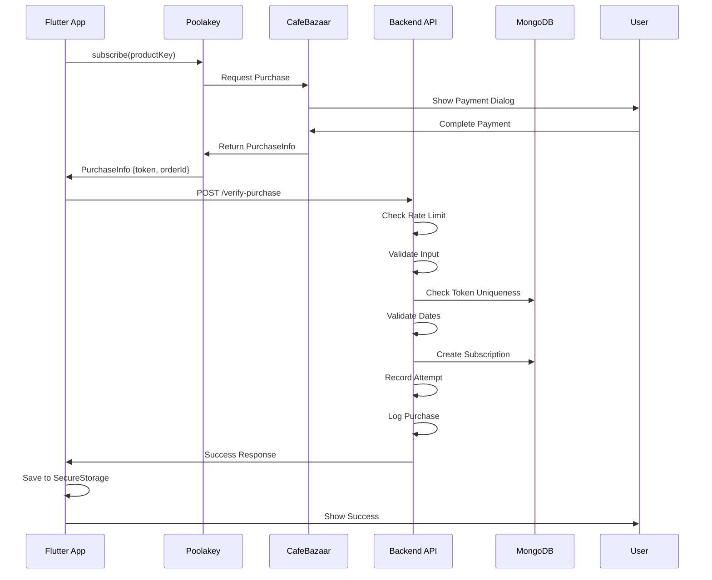

# 🔐 راهنمای کامل Verification خرید CafeBazaar

## 📌 تفاوت IAP vs Payment Gateway

### In-App Purchase (IAP) - پیاده‌سازی فعلی ما ✅

```
کاربر در اپ
    ↓
FlutterPoolakey.subscribe()
    ↓
دیالوگ پرداخت CafeBazaar
    ↓
PurchaseToken دریافت می‌شود
    ↓
Backend تأیید می‌کند
    ↓
اشتراک فعال می‌شود
```

**مزایا:**
- ✅ UX بهتر (کاربر از اپ خارج نمی‌شود)
- ✅ امنیت بیشتر (مستقیم با CafeBazaar)
- ✅ مدیریت آسان‌تر اشتراک‌ها
- ✅ بدون نیاز به درگاه پرداخت

### Payment Gateway - کد مرجع شما

```
کاربر به سایت
    ↓
Redirect به درگاه بانک
    ↓
پرداخت آنلاین
    ↓
Callback به سرور
    ↓
Verification با API درگاه
    ↓
تکمیل خرید
```

**استفاده:**
- ✅ برای web apps
- ✅ پرداخت مستقیم کارت به کارت
- ✅ نیاز به درگاه پرداخت (ZarinPal, Saman, etc.)

## 🛡️ بهبودهای امنیتی اعمال شده

### 1. Purchase Verification Service جدید

فایل: `server/src/services/purchaseVerificationService.ts`

#### قابلیت‌ها:

**Rate Limiting:**
```typescript
// حداکثر 10 تلاش خرید در ساعت برای هر کاربر
static canAttemptPurchase(userId: string): boolean
```

**Validation های چندگانه:**
```typescript
// اعتبارسنجی کامل داده‌های خرید
static validatePurchaseData({
    productKey,      // بررسی فرمت product key
    purchaseToken,   // بررسی فرمت token
    orderId,         // بررسی فرمت order ID
    payload         // بررسی timestamp (اختیاری)
})
```

**محاسبه خودکار تاریخ‌ها:**
```typescript
// محاسبه تاریخ انقضا براساس نوع پلن
static calculateExpiryDate(planType: 'monthly' | 'yearly', startDate)
```

**Audit Logging:**
```typescript
// ثبت همه تلاش‌های خرید برای audit
static recordAttempt(userId: string, success: boolean)
```

### 2. بهبود Controller

فایل: `server/src/controllers/subscriptionController.ts`

#### تغییرات:

**قبل:**
```typescript
// فقط چک می‌کرد token تکراری نباشد
const existing = await Subscription.findOne({ purchaseToken });
```

**بعد:**
```typescript
// 1. Rate limiting
if (!PurchaseVerificationService.canAttemptPurchase(userId)) {
    return error('Too many attempts');
}

// 2. Validation کامل
const validation = PurchaseVerificationService.validatePurchaseData({...});

// 3. چک token تکراری
const existing = await Subscription.findOne({ purchaseToken });

// 4. Validation تاریخ‌ها
if (!PurchaseVerificationService.validateSubscriptionDates(...)) {
    return error('Invalid dates');
}

// 5. ثبت attempt
PurchaseVerificationService.recordAttempt(userId, true/false);

// 6. Audit logging
this.logPurchase(userId, productKey, orderId, purchaseToken);
```

## 🔒 لایه‌های امنیتی

### Layer 1: Authentication
```typescript
// همه endpoint ها نیاز به JWT token دارند
router.post('/verify-purchase', authenticate, ...);
```

### Layer 2: Rate Limiting
```typescript
// حداکثر 10 تلاش در ساعت
if (!PurchaseVerificationService.canAttemptPurchase(userId)) {
    return 429; // Too Many Requests
}
```

### Layer 3: Input Validation
```typescript
// بررسی فرمت همه ورودی‌ها
- Product Key: 3-100 chars, alphanumeric
- Purchase Token: 20-500 chars
- Order ID: 5-100 chars
- Payload: timestamp در 24 ساعت گذشته
```

### Layer 4: Token Uniqueness
```typescript
// جلوگیری از replay attacks
const existing = await Subscription.findOne({ purchaseToken });
if (existing) return error('Token already used');
```

### Layer 5: Date Validation
```typescript
// بررسی منطقی بودن تاریخ‌ها
- startDate نباید در آینده باشد
- expiryDate باید بعد از startDate باشد
- expiryDate نباید بیش از 2 سال در آینده باشد
```

### Layer 6: Audit Logging
```typescript
// ثبت همه فعالیت‌ها برای بررسی بعدی
console.log('✅ Purchase Verified:', {
    timestamp, userId, productKey, orderId,
    tokenHash // فقط hash token ثبت می‌شود
});
```

## 📊 جریان کامل Verification



## 🔍 چک‌لیست امنیتی

### Backend:
- ✅ Rate limiting (10 attempts/hour)
- ✅ Input validation (format, length, type)
- ✅ Token uniqueness check
- ✅ Payload timestamp validation
- ✅ Date range validation
- ✅ Audit logging
- ✅ Secure token hashing
- ✅ Error tracking
- ✅ Automatic cleanup of old attempts

### Frontend:
- ✅ Secure storage (flutter_secure_storage)
- ✅ Token payload generation
- ✅ Error handling
- ✅ Retry mechanism
- ✅ User feedback

### Database:
- ✅ Unique index on purchaseToken
- ✅ Index on userId + isActive
- ✅ Timestamps for audit
- ✅ Soft delete pattern

## 🚀 استفاده

### تست Verification:

```bash
# Test successful purchase
curl -X POST http://localhost:9000/api/subscription/verify-purchase \
  -H "Authorization: Bearer YOUR_JWT_TOKEN" \
  -H "Content-Type: application/json" \
  -d '{
    "productKey": "yearly_premium",
    "purchaseToken": "valid_token_from_cafebazaar",
    "orderId": "order_12345",
    "payload": "1704722400000"
  }'

# Response:
{
  "success": true,
  "message": "Subscription activated successfully",
  "data": {
    "subscription": {
      "planType": "yearly",
      "isActive": true,
      "startDate": "2025-01-08T...",
      "expiryDate": "2026-01-08T..."
    }
  }
}
```

### تست Rate Limiting:

```bash
# بعد از 10 تلاش ناموفق:
{
  "success": false,
  "message": "Too many purchase attempts. Please try again later."
}
```

### تست Invalid Token:

```bash
# Token تکراری:
{
  "success": false,
  "message": "Purchase token already used"
}

# Token با فرمت نامعتبر:
{
  "success": false,
  "message": "Invalid purchase token format"
}
```

## 📈 Monitoring

### Logs مهم:

```typescript
// Successful purchase
✅ Purchase Verified: {
  timestamp: "2025-01-08T12:00:00.000Z",
  userId: "user_123",
  productKey: "yearly_premium",
  orderId: "order_456",
  tokenHash: "a1b2c3d4e5f6g7h8"
}

// Failed attempt
⚠️ Purchase attempt failed: {
  userId: "user_123",
  reason: "Token already used",
  timestamp: "..."
}

// Rate limit exceeded
🚫 Rate limit exceeded: {
  userId: "user_123",
  attempts: 10,
  timestamp: "..."
}
```

## 🔧 تنظیمات

### Environment Variables:

```bash
# در .env فایل
MONGODB_URI=mongodb://localhost:27017/cal_ai
JWT_SECRET=your_secret_key
NODE_ENV=production
```

### Constants قابل تنظیم:

در `purchaseVerificationService.ts`:
```typescript
private static readonly MAX_ATTEMPTS_PER_HOUR = 10;      // تعداد تلاش
private static readonly CLEANUP_INTERVAL = 3600000;       // پاکسازی (1 ساعت)
```

## 🆚 مقایسه با Payment Gateway

| ویژگی | IAP (پیاده‌سازی ما) | Payment Gateway (کد مرجع) |
|------|---------------------|---------------------------|
| نوع پرداخت | درون برنامه‌ای | آنلاین - درگاه بانک |
| UX | ✅ بهتر | ⚠️ redirect می‌شود |
| امنیت | ✅ CafeBazaar handle می‌کند | ⚠️ نیاز به implementation |
| Verification | ✅ Purchase Token | ✅ API Gateway |
| Signature | ❌ لازم نیست | ✅ HMAC-SHA256 |
| Callback URL | ❌ لازم نیست | ✅ الزامی |
| مناسب برای | 📱 Mobile Apps | 🌐 Web Apps |

## 📚 منابع

- [CafeBazaar IAP Docs](https://developers.cafebazaar.ir/)
- [Flutter Poolakey](https://github.com/cafebazaar/flutter_poolakey)
- [MongoDB Indexes](https://docs.mongodb.com/manual/indexes/)
- [JWT Authentication](https://jwt.io/)

## ✅ نتیجه‌گیری

پیاده‌سازی ما برای **In-App Purchase** بهینه شده و شامل:

1. ✅ Rate Limiting
2. ✅ Input Validation  
3. ✅ Token Uniqueness
4. ✅ Date Validation
5. ✅ Audit Logging
6. ✅ Error Handling
7. ✅ Security Best Practices

این یک سیستم کامل و production-ready است که از بهترین روش‌های امنیتی استفاده می‌کند.

---

**نکته:** اگر در آینده نیاز به Payment Gateway داشتید (برای web یا خرید مستقیم)، می‌توانید از کد مرجعی که نشان دادید به عنوان الگو استفاده کنید.

